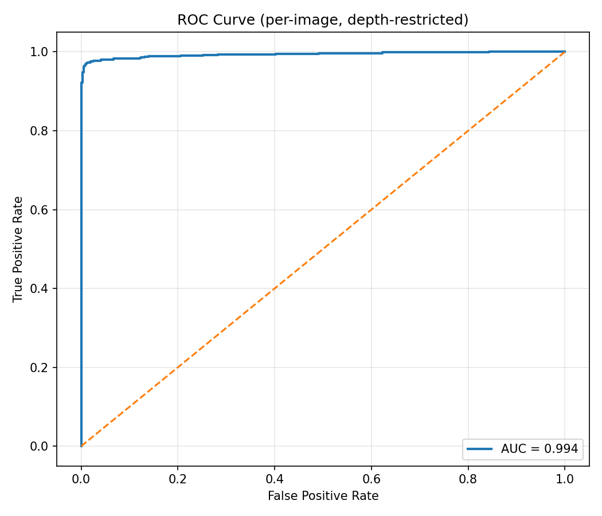
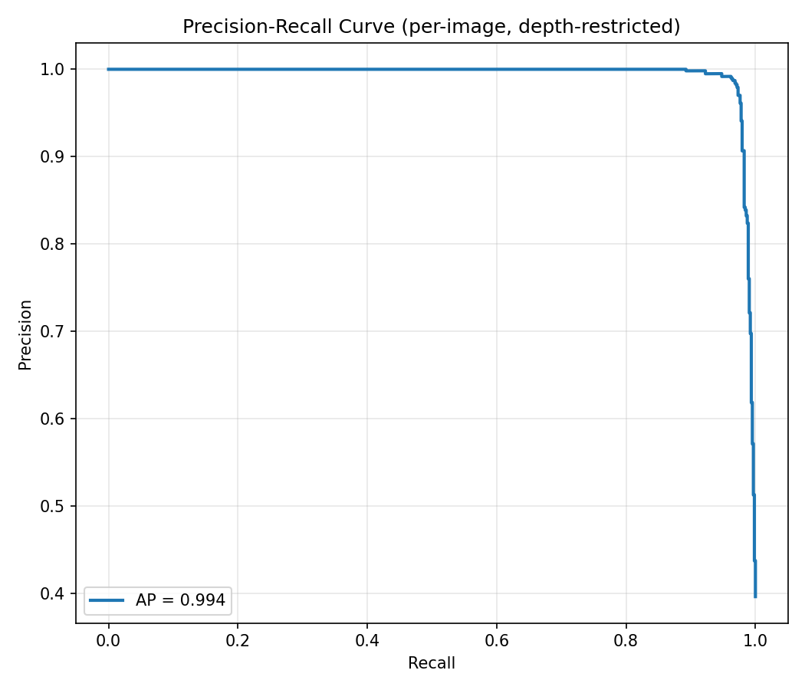
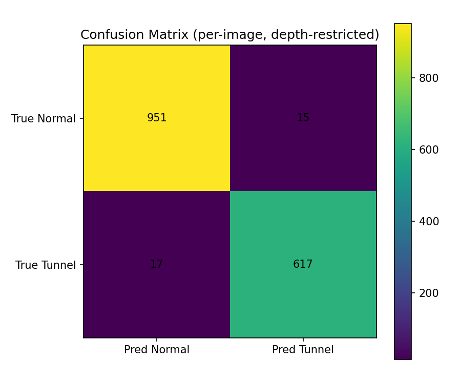
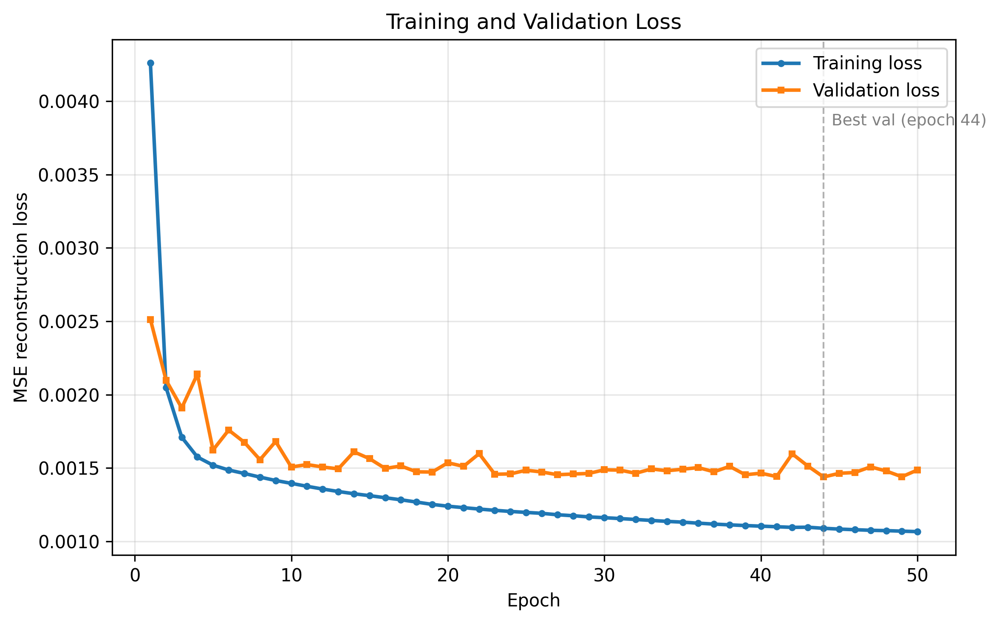
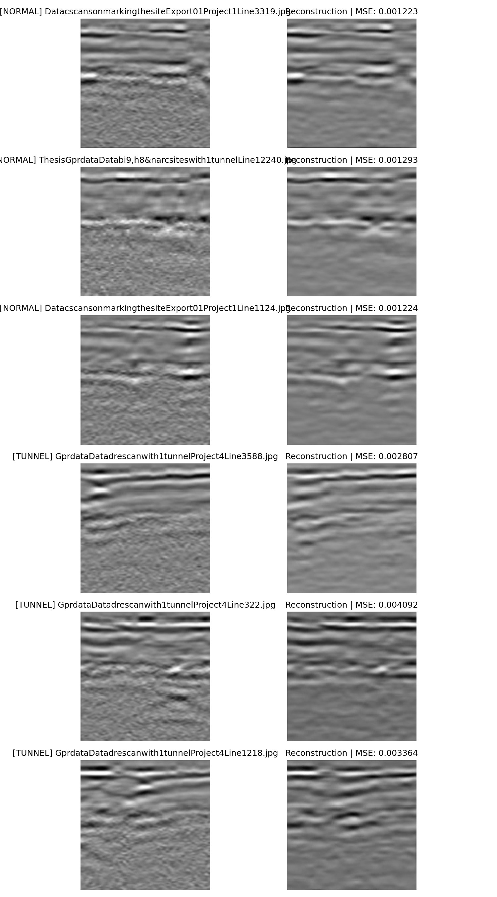
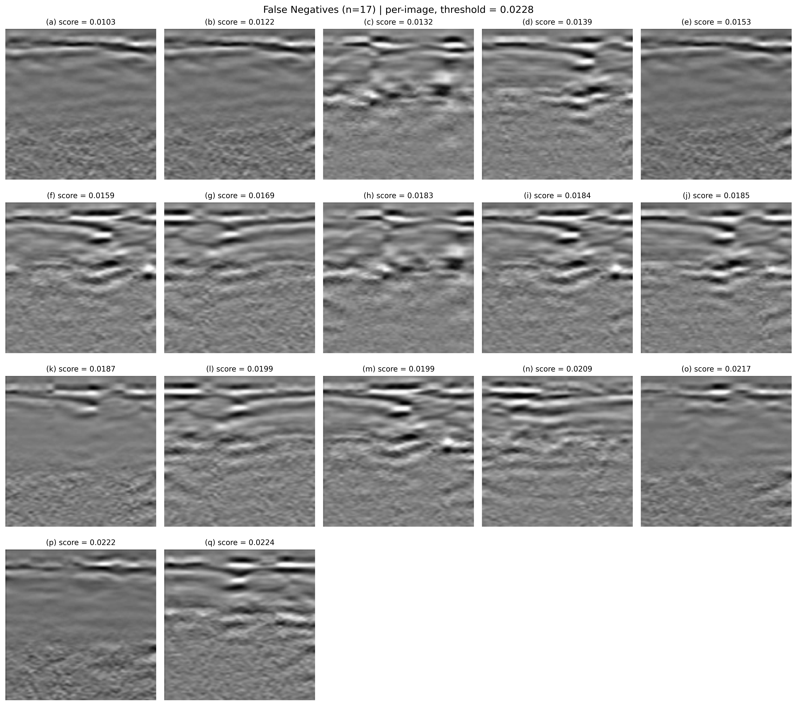
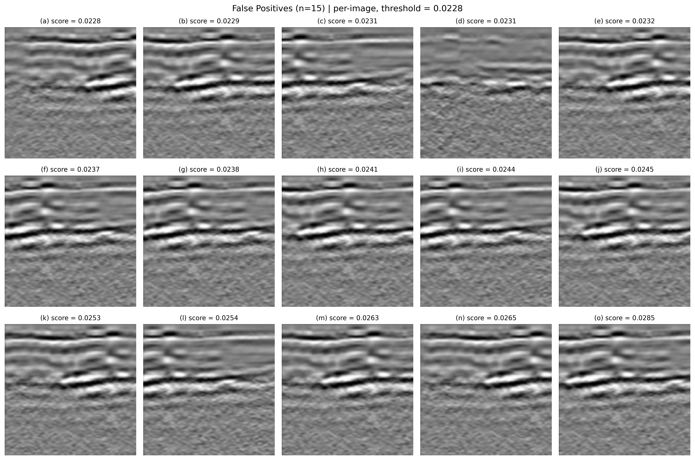
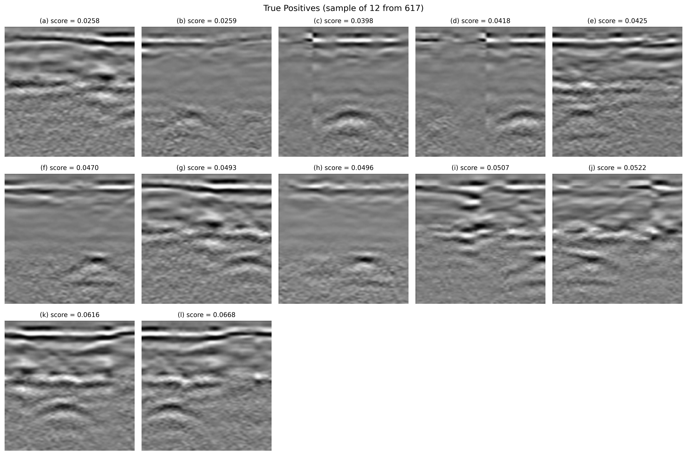

# Unsupervised Detection of Underground Tunnels in Ground-Penetrating Radar Using Depth-Restricted Reconstruction Scoring

Official implementation of the paper:

> **Unsupervised Detection of Underground Tunnels in Ground-Penetrating Radar Using Depth-Restricted Reconstruction Scoring**
> Muhammad Junaid, Shoab A. Khan, Nisar Ahmed
> arXiv:pending
> [Kaggle dataset](https://www.kaggle.com/datasets/muhammadjunaid007/gpr-normal-and-tunnel-anomaly-dataset)
> Paper : https://drive.google.com/file/d/13d0eofVanTqByWJu_J8KviY_jo11D5HD/view?usp=sharing

A fully unsupervised pipeline that detects clandestine tunnels in ground-penetrating radar (GPR) B-scan radargrams. A denoising convolutional bottleneck autoencoder is trained **only on tunnel-free ground**; at inference, tunnels are flagged by where and how badly they fail to reconstruct. The central contribution is a **depth-restricted top-*k* anomaly score** that pools the highest reconstruction errors only within the depth band where tunnels can physically occur — a label-free geometric prior that raises AUC from 0.986 to 0.994 and cuts missed detections by 77% relative to whole-image scoring, without any retraining.

**No tunnel labels are used for training, scoring, or threshold calibration.**

---

## Table of contents

- [Headline results](#headline-results)
- [Method at a glance](#method-at-a-glance)
- [Installation](#installation)
- [Data](#data)
- [Pretrained weights](#pretrained-weights)
- [Reproduce the paper](#reproduce-the-paper)
- [Full metric report](#full-metric-report)
- [Ablation](#ablation-paper-table-v)
- [Threshold sweep](#threshold-sweep-paper-table-vii)
- [Error analysis](#error-analysis)
- [Repository layout](#repository-layout)
- [Citation](#citation)
- [License](#license)

---

## Headline results

Final detector — depth-restricted top-5% MSE with threshold *τ* = *μ* + 2.5*σ* over normal-class scores. Test set: 1,600 field windows (966 normal / 634 tunnel) across 55 survey lines.

| Metric | Value | 95% Wilson CI |
|---|---|---|
| **AUC-ROC** | **0.9936** | — |
| **F1** | **0.9747** | — |
| **Precision** | **0.9763** | [0.9612, 0.9856] |
| **Recall** | **0.9732** | [0.9575, 0.9832] |
| Specificity | 0.9845 | [0.9745, 0.9906] |
| Accuracy | 0.9800 | [0.9719, 0.9858] |
| MCC | 0.9582 | — |
| Cohen's κ | 0.9582 | — |
| FPR | 0.0155 (15 / 966) | — |
| FNR | 0.0268 (17 / 634) | — |

<p align="center">
  
  
</p>

<p align="center">
  
</p>

Of 634 tunnel windows: **617 detected, 17 missed** (all truncated edge windows — see [Error analysis](#error-analysis)). Of 966 normal windows: **951 correctly classified, 15 false alarms**.

---

## Method at a glance

**1. Denoising autoencoder trained on normal-only windows.** Convolutional bottleneck architecture with a 256-D latent (64:1 compression, forces the network to keep only structural regularities of tunnel-free ground). Trained with Gaussian noise (σ = 0.05) added to inputs and MSE loss against the *clean* target — this prevents an identity mapping and widens the reconstruction-error gap between classes at inference. Best-validation-loss checkpointing.

<p align="center">
  
</p>

**2. Depth-restricted top-*k* scoring — the paper's contribution.** For each test window *x* with reconstruction *x̂*, form the squared-error map *E* = (*x* − *x̂*)². The anomaly score is the mean of the top-5% highest pixel errors drawn *only* from the lower half of *E* (rows 64–127 of the 128-row window). Tunnels in this survey site sit below the 1.2 m midpoint of a 2.4 m scan window, so nothing above row 64 can be a tunnel — pooling there just injects nuisance error from the direct-wave arrival and shallow soil clutter. The restriction requires no labels and uses only survey geometry.

**3. Unsupervised threshold.** *τ* = *μ*<sub>normal</sub> + 2.5 *σ*<sub>normal</sub>, computed on scored normal-class windows alone. No tunnel labels are used for calibration.

**4. (Optional) No-demote *N*-of-*M* spatial aggregation.** Consecutive windows overlap by ~90%, so a real tunnel spans many neighbours. For every window, look at the *M* consecutive windows centred on it within the same survey line; if at least *N* are already flagged, promote the window to positive. A confirmed detection is never demoted. In this paper aggregation is a *safety net for weak detectors* — it helps the full-image baselines but adds nothing on top of the depth-restricted scoring rule (see ablation below).

<p align="center">
  
</p>

Normal ground reconstructs faithfully; the hyperbolic tunnel signature does not, concentrating reconstruction error in the lower depth band that the score pools over.

---

## Installation

```bash
git clone https://github.com/Codingcahesession/gpr-tunnel-detection.git
cd gpr-tunnel-detection
pip install -r requirements.txt
```

Requires Python ≥ 3.10 and PyTorch ≥ 2.0. A CUDA GPU is recommended for training (~1 hour on a single card); inference runs comfortably on CPU.

---

## Data

The full field dataset is publicly hosted on Kaggle:

**[kaggle.com/datasets/muhammadjunaid007/gpr-normal-and-tunnel-anomaly-dataset](https://www.kaggle.com/datasets/muhammadjunaid007/gpr-normal-and-tunnel-anomaly-dataset)**

Contents:

- **19,743** normal subsurface radargrams (200-MHz GPR, varied terrain: clay, sand, cultivated soil, moist ground, scattered buried debris, in and around Islamabad, Pakistan).
- **1,600** labeled test windows — 966 normal, 634 tunnel — across **55 survey lines** over three hand-excavated tunnels (1.5–3 m deep, 3–6 m wide).

Download and extract into a `data/` folder at the repo root:

```
gpr-tunnel-detection/
└── data/
    ├── Training_and_Validation/Site_A/          # normal-only training pool
    ├── Inference_with_line_folders/             # test windows organised by survey line
    │   ├── Line 1/
    │   ├── Line 2/
    │   └── ...
    └── Inference_with_separate_folders/         # same test images, flat layout
        ├── normal/
        └── tunnel/
```

The paths above are the defaults; override them by editing the `INFERENCE_ROOT` / `NORMAL_DIRS` constants at the top of each script.

### Generating the labels CSV

The evaluation scripts read `inference_labels.csv` (columns: `survey_line`, `filename`, `label`) to pair every test window with its label and survey-line assignment. To generate it after downloading the dataset:

**1. List the files** — one line per file, three listings needed. Cross-platform:

<details><summary>Linux / macOS / Git-Bash</summary>

```bash
find data/Inference_with_separate_folders/normal -type f -printf "%f\n" > normal_files.txt
find data/Inference_with_separate_folders/tunnel -type f -printf "%f\n" > tunnel_files.txt
find data/Inference_with_line_folders            -type f > line_folder_files.txt
```
</details>

<details><summary>Windows PowerShell</summary>

```powershell
Get-ChildItem "data\Inference_with_separate_folders\normal" -Recurse -File | Select-Object -ExpandProperty Name     > normal_files.txt
Get-ChildItem "data\Inference_with_separate_folders\tunnel" -Recurse -File | Select-Object -ExpandProperty Name     > tunnel_files.txt
Get-ChildItem "data\Inference_with_line_folders"            -Recurse -File | Select-Object -ExpandProperty FullName > line_folder_files.txt
```
</details>

**2. Build the CSV.** This walks the three listings, reconciles the flat-folder labels with the survey-line-folder layout, and writes `inference_labels.csv`:

```bash
python build_labels_csv.py
```

The script prints a summary and flags any unmatched or conflicting entries.

---

## Pretrained weights

The best-validation checkpoint used for all reported results — `gpr_best_model.pt` (~37 MB) — is attached to the [GitHub Releases](../../releases) page.

<!-- TODO: upload as a release asset before publishing -->

Download it and place it in the repo root next to the scripts. Every eval script expects `./gpr_best_model.pt` by default.

---

## Reproduce the paper

### 1. Verify the dataset composition (Table I)

Recomputes every count directly from disk and reruns the deterministic split logic used at training time — so you get the exact same train/validation partition:

```bash
python verify_dataset_table.py
```

Expected output includes: raw normal images, 80/20 train/validation split, 10× augmentation factor, test set counts (966 / 634 / 1600).

### 2. Retrain from scratch (optional)

Skip this if you're using the released checkpoint; run it to reproduce training from scratch. GPU strongly recommended; ~1 hour on a single modern card.

```bash
python train.py
```

Writes:
- `gpr_best_model.pt` — best-validation checkpoint (this is what evaluation uses)
- `gpr_final_model.pt` — end-of-training checkpoint
- `gpr_model_checkpoint.pth` — full training-resume state
- `Results/Training/` — loss curves, sample reconstructions, previews

### 3. Evaluate the adopted method (Table VI, headline numbers)

Depth-restricted top-5% scoring + *τ* = *μ* + 2.5*σ*, with aggregation comparison across nine (*M*, *N*) configurations:

```bash
python evaluate.py
```

Writes `Results/Inference_Final/`:
- `metrics_report_baseline_per_image.{txt,csv}` — the paper's Table VI
- `metrics_report_aggregated_M<M>_N<N>.{txt,csv}` — best aggregation config
- `roc_curve.png`, `precision_recall_curve.png`, `confusion_matrix_*.png`
- `threshold_sweep.csv` — the paper's Table VII (six operating points)
- `window_comparison.csv` — all nine aggregation configurations side by side
- `per_image_scores.csv` — every window's score, raw prediction, and each aggregated prediction
- `survey_groups.csv` — per-line window counts and class balance
- FN/FP inspection folders (panels + originals) for both baseline and best-aggregated
- Thesis-grade grid figures for FN / FP / TP-sample / TN-sample

### 4. Reproduce the rest of the ablation

| Paper table | Method | Command |
|---|---|---|
| Table V row 1 | Global MSE (whole-image mean) | `python evaluate_global_mse.py` |
| Table V rows 2 + 3 | Top-5% MSE (full image), without and with *M*=7, *N*=3 aggregation | `python evaluate_aggregation_only.py` (writes both the per-image baseline report and the aggregated report) |
| Table V rows 4 + 5 | **Depth-restricted top-5%**, without and with aggregation | `python evaluate.py` |
| Table III | Top-*k* sweep on the full image, *k* ∈ {1, 2, 5, 10}% | `python evaluate_topk_sweep.py` |
| Table IV | Top-*k* under depth restriction | `python evaluate.py` with `TOP_FRACTION = 0.05` (default) and again with `TOP_FRACTION = 0.01` (edit the constant at the top of the script) |

---

## Full metric report

Verbatim output of `evaluate.py` for the adopted method (Table VI in the paper):

```
GPR ANOMALY DETECTION - BASELINE_PER_IMAGE
============================================================

Per-image classification (no aggregation).
Scoring: top-5.0% MSE within rows 64..127 (depth-restricted).
Threshold rule: mean + 2.5*std on normal scores.

Threshold value: 0.022820
Test samples: N = 1600  (normal = 966, tunnel = 634)
Confusion matrix:  TN=951  FP=15  FN=17  TP=617

Threshold-free metrics
  AUC-ROC              : 0.9936
  Average Precision    : 0.9937

Classification metrics (95% Wilson CI)
  Accuracy             : 0.9800  [0.9719, 0.9858]
  Precision (PPV)      : 0.9763  [0.9612, 0.9856]
  Recall / TPR         : 0.9732  [0.9575, 0.9832]
  Specificity / TNR    : 0.9845  [0.9745, 0.9906]
  F1                   : 0.9747
  F2                   : 0.9738
  Balanced accuracy    : 0.9788
  MCC                  : 0.9582
  Cohen's kappa        : 0.9582
  G-mean               : 0.9788

Error rates
  FPR                  : 0.0155  (15/966)
  FNR                  : 0.0268  (17/634)
  NPV                  : 0.9824
```

---

## Ablation (paper Table V)

All rows share the same autoencoder and the same *μ* + 2.5*σ* threshold rule computed on normal-class scores. AUC/AP are unchanged by aggregation, which operates on thresholded predictions rather than scores.

| # | Method | AUC | AP | F1 | Precision | Recall | MCC | FN | FP |
|---|---|---|---|---|---|---|---|---|---|
| 1 | Global MSE (whole-image mean) | 0.9417 | 0.9255 | 0.7217 | 0.9582 | 0.5789 | 0.6446 | 267 | 16 |
| 2 | Top-5% MSE (full image) | 0.9855 | 0.9814 | 0.9218 | 0.9639 | 0.8833 | 0.8763 | 74 | 21 |
| 3 | Top-5% + aggregation (*M*=7, *N*=3) | 0.9855 | 0.9814 | 0.9443 | 0.9534 | 0.9353 | 0.9084 | 41 | 29 |
| 4 | **Depth-restricted top-5% (ours)** | **0.9936** | **0.9937** | **0.9747** | **0.9763** | 0.9732 | **0.9582** | **17** | **15** |
| 5 | Depth-restricted + aggregation (*M*=3, *N*=2) | 0.9936 | 0.9937 | 0.9740 | 0.9747 | 0.9732 | 0.9569 | 17 | 16 |

Three takeaways from these rows:

- **The dilution problem dominates the naive baseline.** Row 1 misses 42% of tunnels because a tunnel hyperbola occupies a small fraction of a window and gets averaged away. Top-5% pooling alone (row 2) recovers most of that gap (recall 0.58 → 0.88) with no retraining.
- **The depth restriction delivers the largest single improvement.** Row 2 → row 4: AUC 0.986 → 0.994, missed tunnels 74 → 17, false positives 21 → 15. Both error types drop simultaneously — the restriction tightens the score distribution rather than trading one type for the other.
- **Spatial aggregation helps weak baselines, not strong ones.** Row 2 → 3 gains +0.023 F1; row 4 → 5 yields −0.001. Once scoring is strong, the residual misses are systematic (runs of consecutive faint-tunnel windows lacking any confirmed neighbour to vote them in) rather than isolated recoverable ones.

---

## Threshold sweep (paper Table VII)

The unsupervised default *μ* + 2.5*σ* sits at a balanced operating point. The score function is fixed, so an operator can shift along the precision–recall trade-off at deployment time without touching the model:

| Rule | Threshold | FP | FN | F1 | Accuracy |
|---|---|---|---|---|---|
| **μ + 2.5σ (default)** | **0.02282** | **15** | **17** | **0.9747** | **0.9800** |
| p95 | 0.02030 | 49 | 13 | 0.9525 | 0.9613 |
| p97 | 0.02149 | 29 | 14 | 0.9665 | 0.9731 |
| p98 | 0.02218 | 20 | 15 | 0.9725 | 0.9781 |
| p99 | 0.02337 | 10 | 20 | 0.9762 | 0.9812 |
| p99.5 | 0.02463 | 5 | 24 | 0.9768 | 0.9819 |

---

## Error analysis

**False negatives (n = 17)** — every missed window is a truncated edge view where the tunnel hyperbola is only partially inside the frame; its reconstruction error stays near normal levels. The survey's 90% overlap guarantees the same tunnel appears fully in adjacent windows, where it *is* detected, so these edge misses do not translate into missed tunnels at the survey level.

<p align="center">
  
</p>

**False positives (n = 15)** — windows with unusually strong shallow-soil disturbance, plausibly high local moisture, producing lower-band textures outside the training distribution. Genuine model limitations, but of a benign kind for the application: they flag ground that merits a second look.

<p align="center">
  
</p>

**True positives (12-sample)** — representative correctly-detected tunnel windows.

<p align="center">
  
</p>

Re-running `evaluate.py` writes these grids in `Results/Inference_Final/` for both the per-image detector and the best aggregation configuration, alongside per-image folders (`false_negatives_baseline_per_image/panels/` and `.../original_images/`) for individual inspection.

---

## Repository layout

```
gpr-tunnel-detection/
├── train.py                        # denoising AE training (paper Section IV-B)
├── evaluate.py                     # HEADLINE eval: depth-restricted top-5% + aggregation comparison
├── evaluate_global_mse.py          # ablation: whole-image mean (Table V row 1)
├── evaluate_topk_sweep.py          # top-k fraction sweep (Tables III + IV)
├── evaluate_aggregation_only.py    # aggregation on the full-image score (Table V row 3)
├── build_labels_csv.py             # writes inference_labels.csv from folder listings
├── verify_dataset_table.py         # reproduces the paper's Table I directly from disk
├── figures_scripts/                # optional visualisation utilities
│   ├── make_thesis_loss_outputs.py       # renders publication-quality loss curves
│   ├── organize_errors_linewise.py       # groups FNs/FPs by survey line for inspection
│   ├── panel_all_categories.py           # multi-category (FN/FP/TP/TN) reconstruction panels
│   ├── panel_normal_tunnel.py            # normal-vs-tunnel side-by-side reconstructions
│   └── show_denoising_examples.py        # visualises the denoising augmentation
├── assets/                         # figures embedded in this README
├── requirements.txt
├── LICENSE                         # MIT
├── CITATION.cff
└── README.md
```

The four `evaluate_*.py` scripts share the loading / scoring / metric-reporting patterns, but each is self-contained (no shared library) so any single row of the ablation can be reproduced independently.

---

## Citation

```bibtex
@misc{junaid2026gpr,
  title={Unsupervised Detection of Underground Tunnels in Ground-Penetrating
         Radar Using Depth-Restricted Reconstruction Scoring},
  author={Junaid, Muhammad and Khan, Shoab A. and Ahmed, Nisar},
  year={2026},
  eprint=in process,
  archivePrefix=in process,
  primaryClass={cs.CV}
}
```

---

## License

Code: [MIT](LICENSE).
Dataset: see the license on the [Kaggle page](https://www.kaggle.com/datasets/muhammadjunaid007/gpr-normal-and-tunnel-anomaly-dataset).
